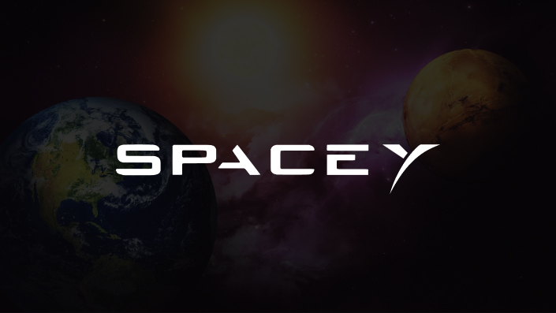

# SpaceY



## 📷 Screenshot


## 📋 Descrição

Embarque nessa incrível viagem para Marte com a SpaceY.

Este projeto consiste em uma landing page inspirada no planeta vermelho e no sonho da humanidade de se tornar uma espécie multiplanetária.

## 🧪 Tecnologias

Foram utilizadas as seguintes tecnologias neste projeto

- [React](https://pt-br.legacy.reactjs.org)
- [TypeScript](https://www.typescriptlang.org)
- [Styled-components](https://styled-components.com)
- [Framer Motion](https://www.framer.com/motion/)
- [Ticker](https://www.npmjs.com/package/framer-motion-ticker)
- [Toast](https://www.npmjs.com/package/react-toastify/v/8.0.3)
- [react-hook-form](https://react-hook-form.com/get-started)
- [zod](https://zod.dev)
- [json-server](https://www.npmjs.com/package/json-server)

## 🚀 Instalação

No terminal clone a pasta do projeto com seguinte comando:

```bash
1. git clone https://github.com/gabrielEmilio00/space-y.git

2. cd space-y
```

Em seguida instale as dependências com

```bash
3. npm install
```

E por fim rode o projeto

```bash
4. npm run start

5. npm run database
```

Após rodar acesse o endereço [http://localhost:3000](http://localhost:3000)

## 🔖 Layout

O layout foi desenvolvido por [Figmentor](https://figmentor.cc) e está diponível no Figma community.

- [Layout](https://www.figma.com/community/file/986447430009792279/spacey-figmentor)

## 📊 Status do projeto

✔️ Concluído
